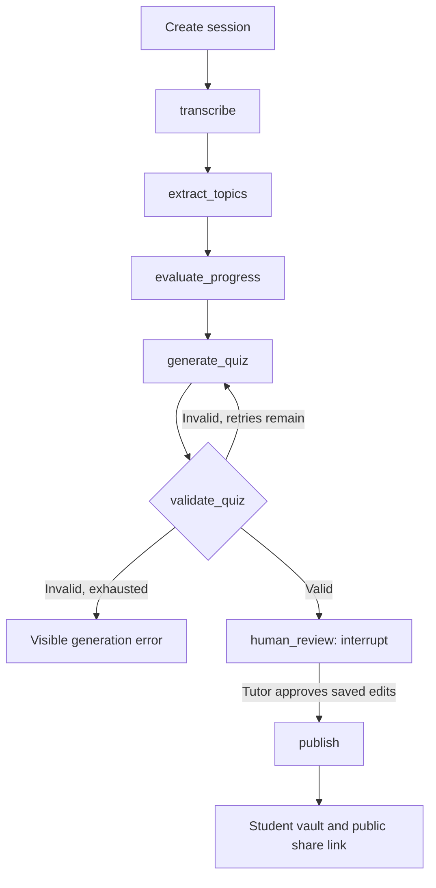

# Architecture

[← README](../README.md)

## Stack

| Layer | Implementation |
|---|---|
| Runtime | Python 3.11+ |
| HTTP application | FastAPI |
| Frontend | Jinja2 templates, HTMX polling, plain CSS |
| Model access | LangChain, OpenAI and DeepSeek integrations |
| Workflow | LangGraph `StateGraph` |
| Review persistence | SQLite `SqliteSaver` |
| Application database | SQLite via SQLAlchemy |
| Transcription | OpenAI `whisper-1` or explicit sample transcript |
| Observability | LangSmith traces and optional evaluations |

## Session flow



`extract_topics`, `evaluate_progress`, and `generate_quiz` each use `with_structured_output(PydanticModel)`. Prompts live in `app/agent/prompts.py`; the workflow never extracts structured output from free text with regular expressions.

Progress assessment receives the current and previous transcripts. It requests concrete evidence for improvement, repeated difficulties, and newly introduced topics. Without a previous session, feedback explicitly establishes a baseline. Quiz generation receives the transcripts, topics, and progress assessment so questions can target weak areas at the lesson's level.

## Validation and repair

Quiz validation is deterministic Python. It checks 3–5 questions, required fields, unique positive IDs, supported question types and difficulties, four distinct nonempty multiple-choice options, and an answer that exactly matches an option. Short-answer questions have no options.

Structured parsing errors also enter the repair loop. Each regeneration receives the specific validation failures. There are at most **three attempts: one initial generation plus two retries**. Exhaustion stops before review and publication. When no previous session is linked, generated difficulty is `same`, relative to the current lesson's baseline.

Tutor edits are validated before replacing saved content. Invalid edits return the form with an error and preserve the previous database version.

## Review and publication

The initial graph invocation pauses at `human_review`. The pipeline service stores the generated output and changes the application session from `processing` to `draft`.

**Save** updates `SessionOutput` and sets `edited=true`, leaving the graph paused. **Share** loads the latest saved output and passes it through `Command(resume=...)` on the same thread. The review node validates the approved content and updates graph state before publication.

Publication persists the approved content, changes the status to `shared`, and creates a token with `secrets.token_urlsafe`. Repeated Share submissions reuse that token. Saving edits to a shared lesson updates its existing vault page and share link.

The review node has no database writes before `interrupt()`, because LangGraph restarts an interrupted node from its beginning on resume. If publication fails after approval, retrying Share resumes publication with the latest saved edits and does not rerun the generation nodes.

## Persistence and execution

| Store | Responsibility |
|---|---|
| `epistemy.db` | Users, sessions, editable outputs, paid status, booking URLs |
| `checkpoints.db` | Durable graph execution state and pending review interrupts |
| `data/uploads/` | Uploaded recordings and local runtime files |

Each session uses `thread_id=session-{id}`. Checkpoints contain JSON-compatible state, with Pydantic validation at model and review boundaries. The app owns its checkpointer connection for the application lifespan.

Generation runs in a synchronous FastAPI `BackgroundTasks` job. Jobs open their own SQLAlchemy sessions and do not hold database transactions across model calls. Per-session locks serialize generation, saving, and sharing within the single application process.

The specified application statuses remain `processing`, `draft`, and `shared`. A nullable `processing_error` records failures and stops HTMX polling. It supplements the statuses without publishing incomplete results.

Checkpoints preserve completed workflow steps, but background jobs are not a durable work queue. After a restart, pending reviews resume through Share; interrupted processing uses the [recovery command](usage.md#restart-and-failure-recovery).

## Observability

Graph invocations use a session run name, `tags=["epistemy"]`, and session metadata. LangSmith shows node-level traces for generation and for the resumed publication invocation. The shared thread ID associates both parts of the workflow.

The evaluation script uses a versioned dataset of three synthetic lessons. It exercises generation and quiz repair up to the actual review interrupt, checks quiz validity, and uses a structured LLM judge for topic relevance and evidence-grounded progress feedback. These judgments are development signals rather than proof of educational correctness.

## Project layout

```text
app/
  agent/          state, prompts, structured nodes, graph, provider factory
  routes/         mocked login, tutor dashboard, student vault, public sharing
  services/       transcription and pipeline persistence
  templates/      server-rendered pages and polling fragment
  static/         plain CSS
  config.py       environment settings
  db.py           SQLAlchemy engine and database initialization
  models.py       User, Session, SessionOutput
  schemas.py      structured results and edit validation
  main.py         app lifespan, middleware, routes, error handling
data/
  transcripts/    three synthetic lesson fixtures
  videos/         placeholder for local sample recordings
docs/             architecture, configuration, usage
evals/            LangSmith dataset and evaluators
scripts/          model smoke check and interrupted-session recovery
tests/            deterministic workflow, adapter, and HTTP integration tests
seed.py           idempotent demo data
```

Tables are created with SQLAlchemy `create_all`; schema migrations are outside this prototype.
